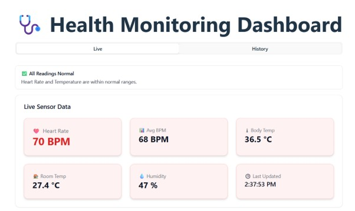
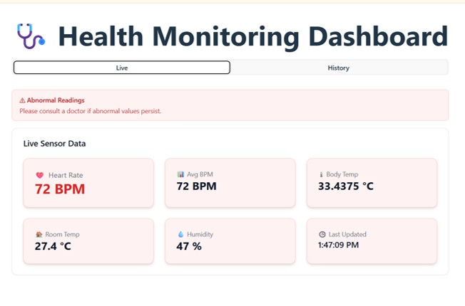
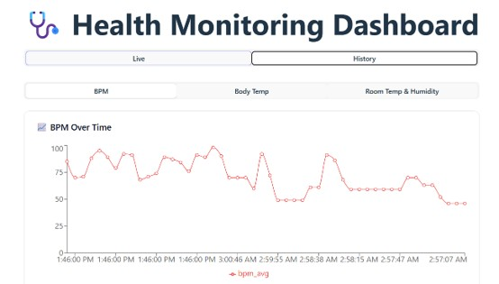
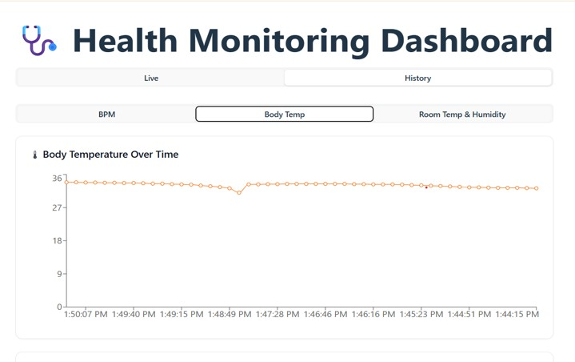
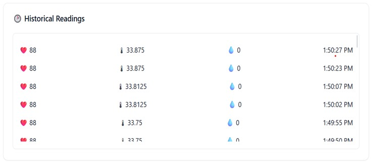

# 🩺 5G-Enabled IoT-Based Healthcare Monitoring System

> A full-stack IoT healthcare platform that collects real-time patient health data from ESP32 sensors, processes it through a Django backend, and visualizes it on an interactive React dashboard. The backend is deployed on Microsoft Azure to enable secure and scalable remote patient monitoring.

---

## 🚀 Features

- 📡 Real-time health data collection using ESP32-based IoT devices
- 🔄 Django REST APIs for secure sensor data ingestion
- 📊 Interactive React dashboard for live patient monitoring
- ☁️ Cloud deployment on Microsoft Azure
- ✅ Backend validation for reliable device-to-server communication
- 📈 Real-time visualization of patient health metrics

---

## 🛠️ Tech Stack

| Category | Technologies |
|----------|--------------|
| **Frontend** | ReactJS |
| **Backend** | Django, Django REST Framework |
| **Database** | SQLite |
| **Hardware** | ESP32, MAX30102, DS18B20 |
| **Cloud** | Microsoft Azure |

---

## 🏗️ System Architecture

```text
ESP32 Sensors
      │
      ▼
Django REST API
      │
      ▼
SQLite Database
      │
      ▼
React Dashboard
      │
      ▼
Microsoft Azure
```

---

## ⚙️ Workflow

1. ESP32 collects real-time patient health metrics from connected sensors.
2. Sensor data is transmitted to Django REST APIs over Wi-Fi.
3. The backend validates and stores incoming health records.
4. React fetches processed data through REST APIs.
5. The dashboard displays patient vitals in real time for continuous monitoring.

---

## ✨ Key Highlights

- Engineered scalable Django REST APIs for IoT data processing.
- Implemented backend validation for reliable sensor communication.
- Built a responsive React dashboard for real-time healthcare visualization.
- Deployed the backend on Microsoft Azure for cloud accessibility.

---

## 📂 Project Structure

```text
Healthcare-Monitoring-System/
│
├── backend/
├── frontend/
└── README.md
```

---

## 📸 Screenshots


### Dashboard

<p align="center">
  
</p>
<p align="center">
  
</p>
<p align="center">
  
</p>
<p align="center">
  
</p>
<p align="center">
  
</p>

---

## 🔮 Future Enhancements

- JWT Authentication
- PostgreSQL Integration
- Docker Containerization
- WebSocket-based live updates
- Alert system for abnormal health readings
- Historical analytics and reporting

---

## 👨‍💻 Author

**Sair Ali**

- 💼 LinkedIn: *https://www.linkedin.com/in/sair-ali-9a7552243/*
- 🐙 GitHub: *https://github.com/SairAli7037/iot-health-monitoring*

---
